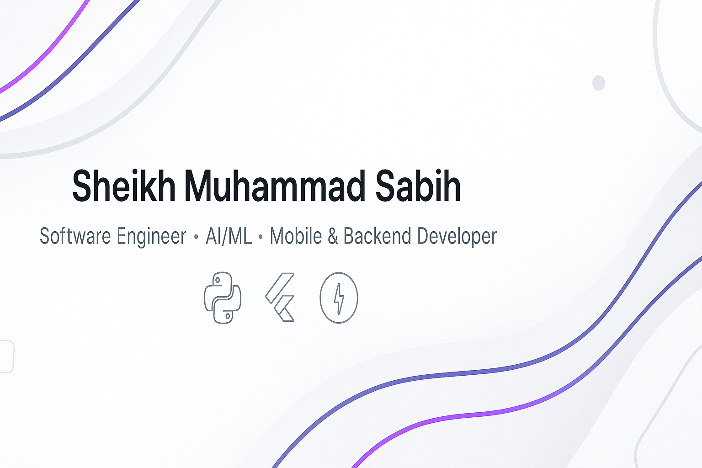

  <picture>
    <source media="(prefers-color-scheme: dark)" srcset="images/banner-dark.png" />
    <source media="(prefers-color-scheme: light)" srcset="images/banner-light.png" />
    
  </picture>

<h1 align="center">Sheikh Muhammad Sabih</h1>
<h3 align="center">Software Engineer • AI/ML Learner • Mobile & Backend Developer</h3>

  

---

## 🚀 About Me

I'm a **multi-disciplinary Software Engineer** who builds products using:

- **Flutter** for mobile  
- **FastAPI / Python / Django** for backend  
- **Next.js & TypeScript** for web  
- **AI Agents, LLM apps, and automation**  

I create scalable SaaS systems, mobile apps, APIs, and AI-powered tools.

---

## 🎯 Current Focus

- AI Agents, ADK, LangChain  
- Building enterprise-grade Flutter apps  
- FastAPI backends with async architecture  
- iOS/Android app publishing  
- Automating real-world workflows with AI  

---

## 🌐 Connect With Me

    
    
    
    

---

## 🛠 Tech Stack

### 🚧 Languages & Frameworks

  

### 🗄 Databases

  

### ⚙️ DevOps & Tools

  

---

## 📊 GitHub Stats

  <picture>
    <source 
      srcset="https://github-readme-stats.vercel.app/api?username=sabihsk&show_icons=true&theme=tokyonight&hide_border=true" 
      media="(prefers-color-scheme: dark)" />
    <source 
      srcset="https://github-readme-stats.vercel.app/api?username=sabihsk&show_icons=true&theme=default&hide_border=true" 
      media="(prefers-color-scheme: light)" />
    
  </picture>

  <picture>
    <source 
      srcset="https://github-readme-streak-stats.herokuapp.com/?user=sabihsk&theme=tokyonight&hide_border=true" 
      media="(prefers-color-scheme: dark)" />
    <source 
      srcset="https://github-readme-streak-stats.herokuapp.com/?user=sabihsk&theme=default&hide_border=true" 
      media="(prefers-color-scheme: light)" />
    
  </picture>

  <picture>
    <source 
      srcset="https://github-readme-stats.vercel.app/api/top-langs/?username=sabihsk&layout=compact&theme=tokyonight&hide_border=true" 
      media="(prefers-color-scheme: dark)" />
    <source 
      srcset="https://github-readme-stats.vercel.app/api/top-langs/?username=sabihsk&layout=compact&theme=default&hide_border=true" 
      media="(prefers-color-scheme: light)" />
    
  </picture>

---

## ✨ Fun Fact  
I don’t just code — I build full real-world products with clean architecture, automation, and AI.

---

⭐ *If you like my work, consider starring a repo — it really motivates me!*
