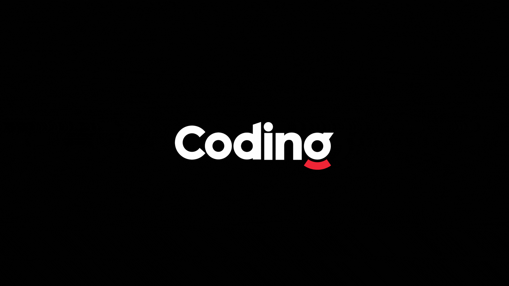

    

<h1 align="center">Hi 👋, I'm Sheikh Muhammad Sabih</h1>
<h3 align="center">A passionate Software Engineer from Pakistan</h3>

    
    

---

### 🚀 About Me

    <table>
        <tr>
            <td>
                <ul>
                    <li> 🔭 I’m currently working on <strong>Python, Flutter, and Data Engineering projects</strong> </li>
                    <li> 🌱 I’m currently learning <strong>Web Scraping</strong> </li>
                    <li> 💬 Ask me about <strong>Python, Flutter, and Data Engineering</strong> </li>
                    <li> 📫 Reach me at <strong>Sabih.sk1@gmail.com</strong> </li>
                </ul>
            </td>
            <td>
                
            </td>
        </tr>
    </table>

---

### 📡 **Connect with Me**

    
    
    
    

---

### 🛠 **Tech Stack & Tools**

    
    
    
    
    
    
    
    
    
    

---

### 📊 **GitHub Stats**

    
     
    
     
    

